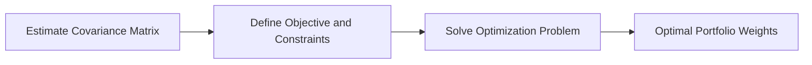

import { Callout, Steps, Step } from "nextra-theme-docs";

# Portfolio Construction

There are several ways to construct carry portfolios, ranging from simple equal-weighting schemes to more sophisticated optimized approaches. In this section, we'll discuss two main methods: inverse volatility weighting and mean-variance optimization.

## Inverse Volatility Weighting

Inverse volatility weighting is a straightforward approach that sizes positions in each market based on their carry signal and volatility. The weight for each market is calculated as:

$\mathbf{w}_{\text{Inverse Volatility,mkt}} = \frac{\text{Signal}_{\text{mkt}}}{\text{Estimated Current Volatility}_{\text{mkt}}}$

Where $\text{Signal}_{\text{mkt}}$ is the carry signal (raw or transformed) for the market, and $\text{Estimated Current Volatility}_{\text{mkt}}$ is the market's current estimated volatility.

<Callout type="info">
Inverse volatility weighting effectively assumes that each market represents an independent risk factor and that cross-sectional effects can be ignored. This may lead to suboptimal portfolio allocations if there are significant correlations between markets.
</Callout>

## Mean-Variance Optimization

Mean-variance optimization is a more sophisticated approach that accounts for the covariance structure between markets when constructing the portfolio. The optimizer seeks to maximize the portfolio's risk-adjusted carry, subject to any specified constraints.

The mean-variance optimal portfolio weights are given by:

$\mathbf{w}_{\text{Mean-Variance}} = \frac{\mathbf{\Sigma}^{-1} \mathbf{\mu}}{\mathbf{1}^T \mathbf{\Sigma}^{-1} \mathbf{S}}$

Where $\mathbf{w}$ is the vector of portfolio weights for each market, $\mathbf{\Sigma}$ is the covariance matrix of returns among markets, and $\mathbf{\mu}$ is the vector of carry signals for each market.

<Steps>
### Step 1: Estimate the Covariance Matrix
Estimate the covariance matrix of returns using historical data. To improve stability, consider techniques like shrinkage or factor models.

### Step 2: Define the Objective Function and Constraints
Set up the optimization problem by defining the objective function (maximize risk-adjusted carry) and any constraints (e.g., leverage, position limits, sector neutrality).

### Step 3: Solve the Optimization Problem
Use a solver to find the optimal portfolio weights that maximize the objective function subject to the specified constraints.
</Steps>

For more details on the performance of [inverse volatility weighted](/performance-analysis/carry-on-the-full-liquid-futures-universe/inverse-volatility-weighted-portfolios) and [optimized](/performance-analysis/carry-on-the-full-liquid-futures-universe/optimized-portfolios) carry portfolios, see the respective subsections in the [Performance Analysis](/performance-analysis) section.